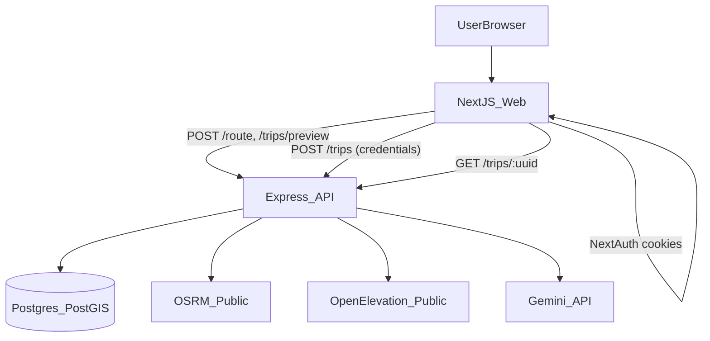

# Trip Planner (PRD v2 MVP)

MVP for **any origin → destination** (geocoded with Nominatim, routed with public OSRM):
- Route options (OSRM public routing)
- Stops along the corridor within **10 km** of the route (PostGIS `ST_DWithin` on curated rows + OpenStreetMap via Overpass, filtered to the same radius)
- Permit zone detection (PostGIS `ST_Intersects`)
- Altitude samples (Open‑Elevation) + simple risk warnings
- AI itinerary (Gemini → structured JSON)
- Save + share (NextAuth Google; public read-only link)

## Repo layout
- `web/`: Next.js 14 UI (Tailwind + Leaflet + OpenStreetMap)
- `api/`: Express REST API (OSRM/Open‑Elevation/Gemini/Postgres)
- `db/`: SQL migrations + seed, plus tiny node runners

## Quickstart (local)
1) Copy env file:

```bash
cp .env.example .env
```

2) Start Postgres + PostGIS:

```bash
npm run db:up
```

3) Run migrations + seed:

```bash
npm run db:migrate
npm run db:seed
```

4) Install deps + run:

```bash
npm install
npm run dev
```

Open `http://localhost:3000`.

## Environment variables
See `.env.example` for the full list.

Minimum required to see the full MVP:
- **DB**: `DATABASE_URL`
- **Maps**: none (Leaflet + OSM tiles)
- **AI**: `GEMINI_API_KEY`
- **Auth**: `NEXTAUTH_SECRET`, `GOOGLE_CLIENT_ID`, `GOOGLE_CLIENT_SECRET`

## Architecture (simple on purpose)



## Notes
- Enter real place names for **from** and **to**; routing and stop discovery follow that corridor.
- Seed no longer inserts demo stops or permit zones by default; add curated rows in Postgres or rely on OSM for preview stops.
- When you add permit polygons, keep them **demo-grade** until you replace with accurate GeoJSON for production.

